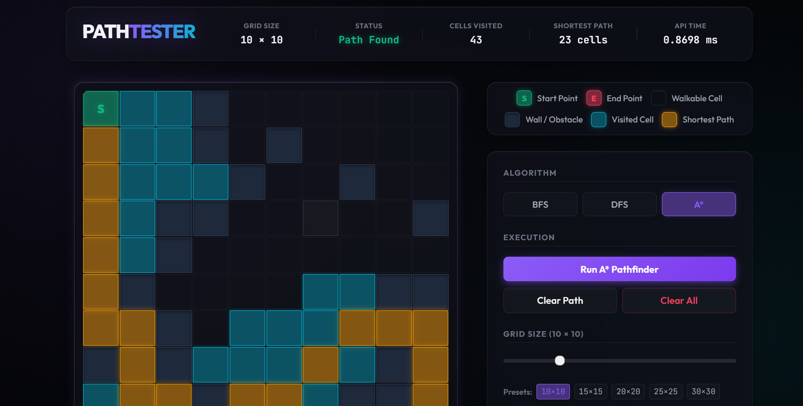
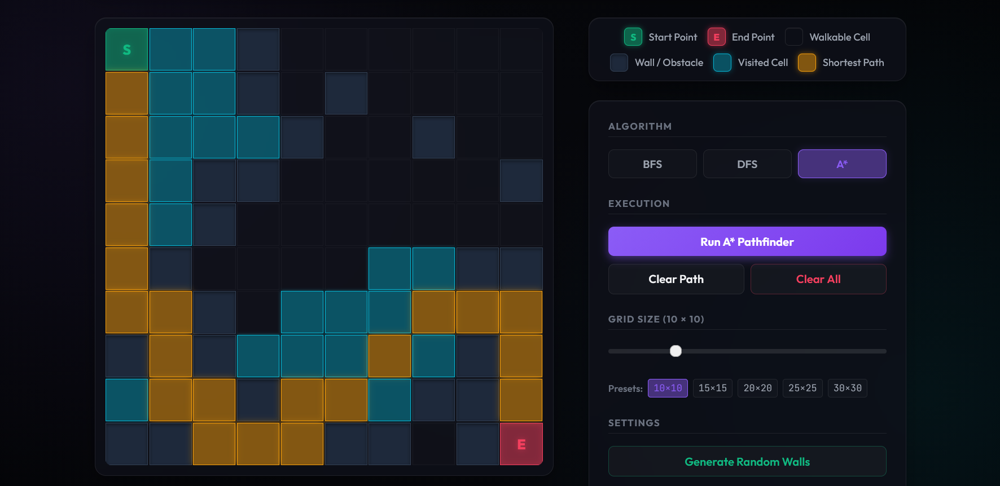

# Path Tester Monorepo Playground

Welcome to the **Path Tester Monorepo Project**! This project serves as an interactive algorithm testing playground and visualization tool for various pathfinding algorithms (such as Breadth-First Search (BFS), Depth-First Search (DFS), and A* Search).

## 📸 Preview





---

## 🚀 How It Works

This application is built as a split-architecture monorepo containing a **React frontend** and a **Java Spring Boot backend**.

1. **Frontend Grid Customization**:
   - The user interacts with a 2D grid matrix interface on the frontend.
   - You can toggle cells to place start/end nodes and draw walls/obstacles (represented as `0` for walls and `1` for walkable path cells).
   - Once a pathfinding query is triggered, the frontend sends this grid configuration to the backend.

2. **Backend Adjacency Conversion & Pathfinding**:
   - The backend accepts the 2D grid matrix and converts it into a graph representation (generating adjacency lists or maps for navigable nodes).
   - It runs the selected pathfinding algorithm starting from the specified `start` point to the `end` point.
   - It returns a unified payload containing two essential components:
     - `path`: The final shortest/found path coordinates from start to target.
     - `traversalOrder`: The sequential list of nodes visited during the search, detailing how the algorithm navigated the grid step-by-step.

---

## 🛠️ Project Structure

For guidelines on coding style, architecture rules, and gitignore file permissions, see [gemini.md](file:///c:/Users/AnyaWalker/Desktop/GeminiPlayGround/pathtester_project/gemini.md).

```
pathtester_project/
├── backend/                  # Java Spring Boot backend project (Maven)
└── frontend/                 # React + Vite frontend project
```

---

## 📡 API Details

The backend exposes the following endpoints (default port `8080`):
- `POST http://localhost:8080/api/bfs` - Breadth-First Search
- `POST http://localhost:8080/api/dfs` - Depth-First Search
- `POST http://localhost:8080/api/astar` - A* Search

### Request Payload Format
```json
{
  "matrix": [
    [1, 1, 1],
    [1, 0, 1],
    [1, 1, 1]
  ],
  "start": { "row": 0, "column": 0 },
  "end": { "row": 2, "column": 2 }
}
```

### Response Payload Format
```json
{
  "path": [
    { "row": 0, "column": 0 },
    { "row": 0, "column": 1 },
    { "row": 0, "column": 2 },
    { "row": 1, "column": 2 },
    { "row": 2, "column": 2 }
  ],
  "traversalOrder": [
    { "row": 0, "column": 0 },
    { "row": 0, "column": 1 },
    { "row": 1, "column": 0 },
    { "row": 0, "column": 2 }
    // ... rest of the traversed nodes
  ],
  "timeTaken": 0.421
}
```

---

## 🏃 Run Locally

To launch the full playground locally, make sure you have both Node.js (v22+) and Java JDK (v21+) installed.

### Run Backend
1. Navigate to the backend directory:
   ```bash
   cd backend
   ```
2. Start the Spring Boot application using Maven:
   - On Windows: `mvnw.cmd spring-boot:run`
   - On Unix/macOS: `./mvnw spring-boot:run`

### Run Frontend
1. Navigate to the frontend directory:
   ```bash
   cd frontend
   ```
2. Install dependencies:
   ```bash
   npm install
   ```
3. Start the Vite development server:
   ```bash
   npm run dev
   ```
4. Open the URL shown in the terminal (usually `http://localhost:5173`) in your browser.
